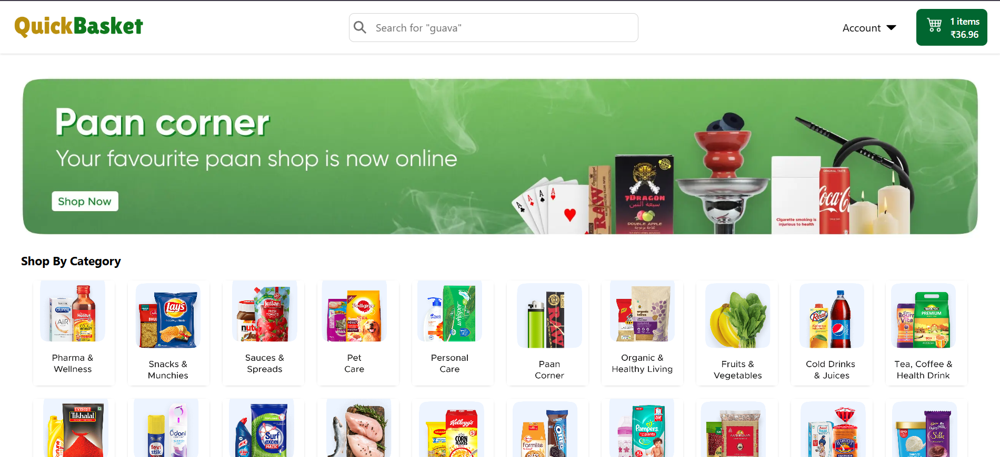

# 🛒 QuickBasket - E-Commerce Website

A modern E-Commerce platform to browse, shop and manage daily essentials, groceries, and household items.

--- 

🌐 **Live Website:** [https://quick-basket-dug9.vercel.app](https://quick-basket-dug9.vercel.app)

## Screenshot

Here is the home page screenshot of the QuickBasket website:

---
## Demo Video

Watch the demo video below to see the QuickBasket in action:

> **Note:** Please click the link below to watch the demo video externally.

[Watch Demo Video on OneDrive](https://www.canva.com/design/DAGxwBpOsvU/WT_JKWU2MpLfMsUwN_i_zg/watch?utm_content=DAGxwBpOsvU&utm_campaign=designshare&utm_medium=link2&utm_source=uniquelinks&utlId=h991be58b2e)

---

### 🖥️ Frontend Features

- User Registration & Login (with Token-based Authentication)
- Responsive UI with Tailwind CSS
- Dynamic Product Listings with Infinite Scroll
- Product Filtering:
  - By Categories
  - By SubCategories
- Product Detail Page with Image Gallery & Details
- Shopping Cart:
  - Add / Remove / Update quantity of products
  - Cart persists across sessions (Redux Persist)
- Checkout Flow:
  - Cash On Delivery (COD)
  - Stripe Payment Integration
- User Profile Page:
  - View & Edit Profile Details
  - Upload Avatar
- My Orders Page with Order History
- Forgot Password Flow with Email OTP Verification
- Smooth Animations & Notifications:
  - SweetAlert2 for alerts
  - React Hot Toast for toasts

---

### 🚀 Backend Features

- User Authentication & Authorization:
  - JWT Access + Refresh Token
  - Secure Cookie Storage
- Role-based Access (User / Admin)
- Product Management (Admin Panel):
  - Create / Update / Delete Product
  - Append / Remove Product Images
- Category & SubCategory Management
- Order Management:
  - Create Order
  - View Order History (User)
- Email Verification & Forgot Password (Resend API)
- Payment Integration (Stripe)
- API Error Handling & Response Standardization

---

## 🛠️ Tech Stack

### Frontend

- React.js 19
- Redux Toolkit
- React Hook Form
- React Infinite Scroll
- React Hot Toast
- React Icons
- React Router DOM
- Stripe Integration
- Tailwind CSS
- SweetAlert2

### Backend

- Node.js
- Express.js
- MongoDB (Mongoose)
- JWT Authentication (Access & Refresh Tokens)
- Cloudinary (for image upload)
- Stripe API
- Resend API (Transactional Emails)
- Multer (Memory & Disk Storage for Images)

---

## 👨‍💻 Author

**Prince Kumar Singh**

---

_This is a personal project developed and maintained by me._ ✌️  
_All rights reserved._

